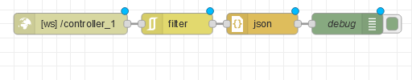

# ESP8266-NodeMCU-8-Button-WebSocket-Controller

This repository contains code for an 8-Button ESP8266-based WebSocket controller designed to interface with Node-RED. It allows you to control and monitor button states from your ESP8266 NodeMCU using WebSocket communication.

## Prerequisites

- [Arduino IDE](https://www.arduino.cc/en/Main/Software)
- [ESP8266 Arduino Core](https://github.com/esp8266/Arduino)

## Getting Started

1. Clone this repository to your local machine.

    ```bash
    git clone https://github.com/HaroldPetersInskipp/ESP8266-NodeMCU-8-Button-WebSocket-Controller.git
    ```

2. Open the `controller.ino` file in the Arduino IDE.

3. Install the required libraries via Arduino Library Manager:

    - ESP8266WiFi
    - WebSockets
    - ArduinoJson

4. Update the following variables in the code:

    - `ssid`: Your Wi-Fi network SSID.
    - `password`: Your Wi-Fi network password.
    - `webSocketServer`: IP address of your Node-RED server.
    - `webSocketPort`: Port of your Node-RED server. (customize if needed).
    - `webSocketEndpoint`: WebSocket endpoint (customize if needed).

5. Optionally, set a unique `esp8266unitNumber` to identify each ESP8266 NodeMCU.

6. Upload the code to your ESP8266 NodeMCU.

## Usage

1. Connect your ESP8266 NodeMCU to the power source.

2. Open the Arduino IDE Serial Monitor to view detailed information about the ESP8266's boot process, Wi-Fi connection, and WebSocket connection.

3. Observe button presses on the Serial Monitor when buttons are pressed. The WebSocket connection status will also be displayed.

4. The WebSocket server will receive button states in real-time.

## Pin Configuration

The ESP8266 NodeMCU is configured with the following GPIO pins for buttons:

- "left" - D4
- "down" - D5
- "up" - D6
- "right" - D7
- "circle" - D3
- "triangle" - D2
- "cross" - D1
- "square" - A0 (analog button)

POWER MUST BE SUPPLIED VIA USB TO USE THE FOLLOWING WIRING DIAGRAM TO FIT ON A HALF SIZE BREADBOARD


## WebSocket Server Configuration

Ensure that your Node-RED server is configured to accept WebSocket connections. The WebSocket endpoint should match the `webSocketEndpoint` defined in the code.

## Node-RED Integration

1. Import the `flow.json` file provided in the repository into your Node-RED instance.

2. The flow includes nodes to receive WebSocket messages from the ESP8266.



## Additional Information

- This code includes detailed boot information, Wi-Fi connection details, and WebSocket connection status in the Serial Monitor.

- The `esp8266unitNumber` provides a unique identifier for each ESP8266 NodeMCU, aiding in device management.

The following is a sample boot message:
```
09:15:27.803 -> Starting the boot process...
09:15:27.803 -> Device identifier: ESP8266controller_1
09:15:27.803 -> Firmware version: 2.2.2-dev(38a443e)
09:15:27.803 -> Boot version: 31
09:15:27.803 -> Boot mode: 1
09:15:27.803 -> CPU frequency: 80
09:15:27.803 -> Flash size: 4194304
09:15:27.803 -> Free heap: 49912
09:15:27.803 -> Heap fragmentation: 0
09:15:27.803 -> Chip ID: 6400687
09:15:27.803 -> Flash chip ID: 1458270
09:15:27.803 -> 
09:15:27.803 -> Connecting to Wi-Fi
09:15:28.661 -> .............
09:15:35.369 -> WiFi connected
09:15:35.369 -> WiFi SSID: Botnet
09:15:35.369 -> WiFi local IP address: 10.0.0.234
09:15:35.369 -> WiFi subnet mask: 255.255.255.0
09:15:35.369 -> WiFi subnet mask: 255.255.255.0
09:15:35.369 -> WiFi gateway IP address: 10.0.0.1
09:15:35.369 -> WiFi DNS server IP address: 75.75.75.75
09:15:35.415 -> WiFi mode: 3
09:15:35.415 -> WiFi channel: 9
09:15:35.415 -> WiFi MAC address: C8:C9:A3:61:AA:AF
09:15:35.415 -> WiFi status: 3
09:15:35.415 -> WiFi RSSI: -44
09:15:35.415 -> Ending the boot process...
09:15:35.415 -> 
09:15:35.415 -> ESP8266controller_1 should now be operational.
09:15:35.415 -> 
09:15:35.415 ->  ★BUTTON LAYOUT★
09:15:35.415 ->  ___ ___ ___ ___ 
09:15:35.415 -> | 0 | 1 | 2 | 3 |
09:15:35.415 -> |---|---|---|---|
09:15:35.415 -> | 4 | 5 | 6 | 7 |
09:15:35.415 ->  --- --- --- --- 
09:15:35.415 -> 
09:15:35.415 -> Connecting to WebSocket
09:15:36.129 -> WebSocket connected
09:15:36.129 -> WebSocket endpoint: http://10.0.0.111:1880/controller_1
```

## License

This project is licensed under the MIT License - see the [LICENSE](https://github.com/HaroldPetersInskipp/ESP8266-NodeMCU-8-Button-WebSocket-Controller/blob/main/LICENSE) file for details.
